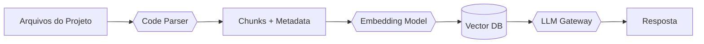

# **RAGlet**  
*Retrieval-Augmented Generation para codebases*  

---

## 🧠 **Visão Técnica**

**RAGlet** é uma ferramenta de linha de comando (CLI) que aplica **RAG (Retrieval-Augmented Generation)** sobre o código-fonte de projetos de software.  
O objetivo é permitir consultas contextuais a partir do próprio conteúdo do projeto — código, arquivos de configuração e documentação local.

Funcionalidades principais:
- **Análise Estrutural**: Parseamento baseado em ASTs para múltiplas linguagens (ex: Python, C#)  
- **Indexação Semântica**: Vetorização e armazenamento de trechos de código com metadados  
- **Geração de Respostas**: Consultas contextuais via LLMs com recuperação baseada em embeddings  

---

## ⚙️ **Arquitetura Geral**

---

## 🧩 **Componentes**
| Módulo               | Tecnologias                             | Status        |
|----------------------|------------------------------------------|---------------|
| **Code Analyzer**    | Tree-sitter, LibCST, Go AST              | Em progresso  |
| **Vector Indexer**   | FAISS, Chroma, SentenceTransformers      | Experimental  |
| **LLM Interface**    | Ollama, OpenAI API, LiteLLM              | Planejado     |
| **Query Engine**     | Busca híbrida (semântica + keyword)      | Em pesquisa   |

---

## 🚧 **Foco Atual**
- [ ] Parser multi-linguagem com Tree-sitter  
- [ ] Embedding de trechos estruturados de código  
- [ ] Integração com Mistral 7B via Ollama  
- [ ] Estratégias de chunking baseadas na estrutura do código  

---

## 📜 **Licença**
Distribuído sob a licença MIT.  
Consulte o arquivo [LICENSE](https://github.com/JVitoroliv3ira/RAGlet/blob/main/LICENSE).
